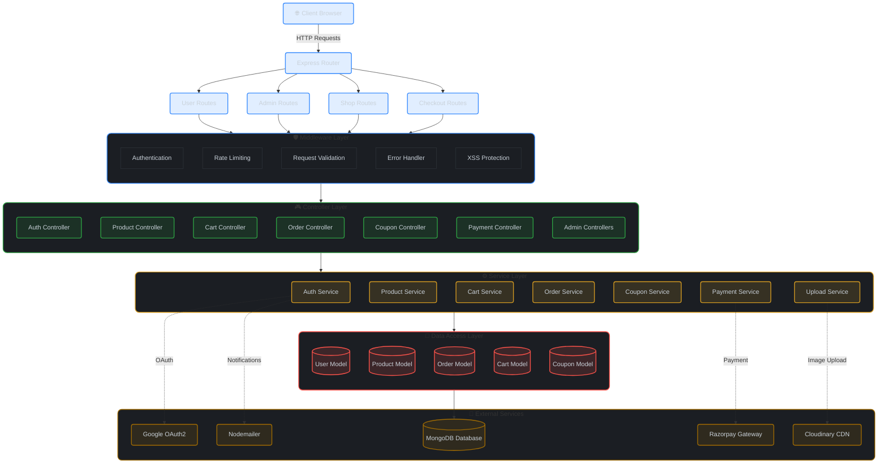
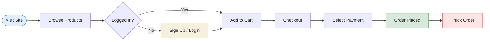
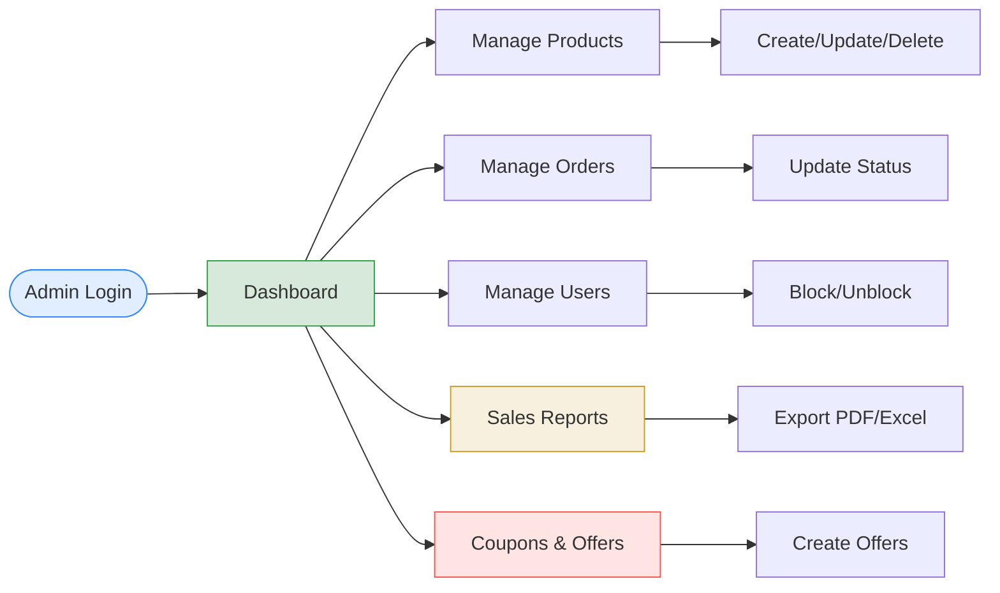

<div align="center">
  <h1>🎧 Audify</h1>
  <p>
    <strong>Premium Audio E-Commerce Platform</strong>
  </p>

[](https://opensource.org/licenses/MIT)


  <p>
    <a href="#-overview">Overview</a> •
    <a href="#-architecture">Architecture</a> •
    <a href="#-technology-stack">Tech Stack</a> •
    <a href="#-features">Features</a> •
    <a href="#-project-structure">Structure</a> •
    <a href="#-configuration">Configuration</a>
  </p>
</div>

---

## 📖 Overview

**Audify** is a full-featured e-commerce platform specialized in premium audio products. Built with modern web technologies, it provides a seamless shopping experience with robust authentication, dynamic product management, and secure payment integration.

### ✨ Key Highlights

- **Multi-Role Access**: Separate interfaces for administrators and customers with role-based access control
- **Secure Authentication**: Google OAuth2 integration with traditional email/password authentication
- **Advanced Shopping Cart**: Real-time cart management with discount calculations
- **Flexible Payment Options**: Razorpay integration, Wallet, and Cash on Delivery (COD)
- **Smart Promotions**: Dynamic coupon and offer management system
- **Digital Wallet**: Built-in wallet system with transaction history
- **Comprehensive Admin Panel**: Product, category, order, user, and sales management

---

## 🏛 Architecture

Audify follows a **Layered MVC Architecture** with clear separation of concerns, ensuring maintainability and scalability.



### 🧠 Design Patterns

- **MVC Architecture**: Clear separation between Models, Views, and Controllers
- **Service Layer Pattern**: Business logic encapsulated in reusable service classes
- **Middleware Pattern**: Request processing pipeline for authentication, validation, and error handling
- **Repository Pattern**: Data access abstraction through Mongoose models

---

## 🛠 Technology Stack

### Backend

| Category            | Technology                                                                                                       | Description                                    |
| :------------------ | :--------------------------------------------------------------------------------------------------------------- | :--------------------------------------------- |
| **Runtime**         |         | JavaScript runtime environment                 |
| **Framework**       |        | Fast, minimalist web framework for Node.js     |
| **Database**        |           | NoSQL document database                        |
| **ODM**             | **Mongoose**                                                                                                     | Elegant MongoDB object modeling for Node.js    |
| **Template Engine** |                       | Embedded JavaScript templating                 |
| **Authentication**  | **Passport.js** + **Google OAuth2**                                                                              | Authentication middleware with OAuth support   |
| **Session**         | **express-session**                                                                                              | Session management middleware                  |
| **Security**        | **bcrypt** + **xss-clean**                                                                                       | Password hashing and XSS protection            |

### Third-Party Integrations

| Service              | Technology                                                                                                  | Purpose                             |
| :------------------- | :---------------------------------------------------------------------------------------------------------- | :---------------------------------- |
| **Payment Gateway**  |   | Secure online payment processing    |
| **Cloud Storage**    |  | Image upload and CDN                |
| **Email Service**    | **Nodemailer**                                                                                              | Transactional email delivery        |
| **PDF Generation**   | **PDFKit** + **jsPDF**                                                                                      | Invoice and report generation       |

### Development Tools

| Tool                   | Technology              | Purpose                          |
| :--------------------- | :---------------------- | :------------------------------- |
| **Linter**             | **ESLint**              | Code quality and style checking  |
| **Formatter**          | **Prettier**            | Code formatting                  |
| **Development Server** | **Nodemon**             | Auto-restart on file changes     |
| **Logger**             | **Winston**             | Application logging              |
| **Validation**         | **express-validator**   | Request data validation          |
| **Rate Limiting**      | **express-rate-limit**  | API rate limiting protection     |

---

## ✨ Features

### 🛒 Customer Features

#### Authentication & Account Management
- ✅ User registration with email/password
- ✅ Google OAuth2 social login
- ✅ Secure password hashing with bcrypt
- ✅ Session-based authentication
- ✅ Account status management (Active/Inactive)
- ✅ Profile management with personal details

#### Shopping Experience
- ✅ **Product Browse & Search**: Explore audio products with detailed descriptions
- ✅ **Product Filtering**: Filter by category, price, and availability
- ✅ **Wishlist Management**: Save products for later
- ✅ **Shopping Cart**: Real-time cart updates with quantity management
- ✅ **Multiple Addresses**: Save and manage multiple delivery addresses
- ✅ **Stock Validation**: Real-time stock availability checks

#### Checkout & Payments
- ✅ **Multiple Payment Methods**:
  - Razorpay online payment gateway
  - Digital wallet
  - Cash on Delivery (COD)
- ✅ **Coupon System**: Apply discount coupons at checkout
- ✅ **Dynamic Pricing**: Automatic discount and offer calculations
- ✅ **Order Confirmation**: Email notifications on successful order

#### Digital Wallet
- ✅ Wallet balance management
- ✅ Credit/Debit transaction tracking
- ✅ Transaction history with descriptions

#### Order Management
- ✅ Order tracking with status updates
- ✅ Order history with detailed information
- ✅ Order cancellation with automatic refunds to wallet
- ✅ Invoice generation (PDF download)

### 🔐 Admin Features

#### Dashboard & Analytics
- ✅ **Sales Dashboard**: Visual sales analytics with Chart.js
- ✅ **Sales Reports**: Generate reports by day, week, month, year, or custom date range
- ✅ **Report Export**: Download reports as PDF or Excel
- ✅ **Revenue Tracking**: Monitor total revenue and order statistics

#### Product Management
- ✅ **CRUD Operations**: Create, Read, Update, Delete products
- ✅ **Image Management**: Upload product images via Cloudinary
- ✅ **Stock Management**: Track and update product inventory
- ✅ **Product Activation**: Enable/disable product visibility
- ✅ **Category Association**: Link products to specific categories

#### Category Management
- ✅ **Category CRUD**: Full category lifecycle management
- ✅ **Category-based Organization**: Organize products by audio categories

#### Order Management
- ✅ **Order Overview**: View all customer orders
- ✅ **Status Updates**: Update order status (Pending → Processed → Shipped → Delivered)
- ✅ **Order Cancellation**: Process order cancellations

#### User Management
- ✅ **User Listing**: View all registered customers
- ✅ **Account Control**: Block/Unblock user accounts
- ✅ **User Activity Monitoring**: Track user status and activity

#### Promotions & Marketing
- ✅ **Coupon Management**:
  - Create discount coupons (percentage or fixed amount)
  - Set minimum cart value requirements
  - Define validity periods
  - Usage limit controls
  - Track coupon usage by users
- ✅ **Offer Management**:
  - Product-specific offers
  - Category-wide offers
  - Referral bonuses
  - Dynamic discount calculations

### 🛡️ Security Features
- ✅ **XSS Protection**: Input sanitization with xss-clean
- ✅ **Rate Limiting**: Protection against brute-force attacks
- ✅ **Secure Sessions**: HTTP-only cookies with secure flags
- ✅ **Password Security**: bcrypt hashing with salt rounds
- ✅ **Input Validation**: express-validator for request validation
- ✅ **Error Handling**: Centralized error handling middleware

---

## 📂 Project Structure

```bash
audify-ejs/
├── src/
│   ├── config/               # ⚙️ Configuration files
│   │   ├── cloudinary.js     # Cloudinary setup
│   │   ├── database.js       # MongoDB connection
│   │   ├── logger.js         # Winston logger configuration
│   │   └── razorpay.js       # Razorpay payment gateway
│   │
│   ├── constants/            # 📌 Application constants
│   │   └── statusCodes.js    # HTTP status code constants
│   │
│   ├── controllers/          # 🎮 Route handlers
│   │   ├── admin/            # Admin-specific controllers
│   │   │   ├── adminAuthController.js
│   │   │   ├── couponManagementController.js
│   │   │   ├── offerManagementController.js
│   │   │   ├── orderManagementController.js
│   │   │   ├── salesReportController.js
│   │   │   └── userManagementController.js
│   │   ├── accountController.js
│   │   ├── authController.js
│   │   ├── cartController.js
│   │   ├── categoryController.js
│   │   ├── checkoutController.js
│   │   ├── couponController.js
│   │   ├── orderController.js
│   │   ├── paymentController.js
│   │   ├── productController.js
│   │   └── shopController.js
│   │
│   ├── middleware/           # 🛡️ Custom middleware
│   │   ├── validators/       # Validation schemas
│   │   ├── adminAuth.js      # Admin authentication
│   │   ├── errorHandler.js   # Error handling
│   │   ├── multer.js         # File upload configuration
│   │   ├── rateLimiter.js    # Rate limiting rules
│   │   ├── requestLogger.js  # Request logging
│   │   └── userAuth.js       # User authentication
│   │
│   ├── models/               # 🗄️ Mongoose schemas
│   │   ├── address.js        # Address schema
│   │   ├── adminModel.js     # Admin user schema
│   │   ├── cart.js           # Shopping cart schema
│   │   ├── categories.js     # Category schema
│   │   ├── coupon.js         # Coupon schema
│   │   ├── offer.js          # Offer schema
│   │   ├── order.js          # Order schema
│   │   ├── orderItem.js      # Order item schema
│   │   ├── products.js       # Product schema
│   │   └── userModel.js      # User schema
│   │
│   ├── routes/               # 🛣️ API route definitions
│   │   ├── accountRoutes.js  # User account routes
│   │   ├── adminRoutes.js    # Admin panel routes
│   │   ├── categoryRoutes.js # Category routes
│   │   ├── checkoutRoutes.js # Checkout flow routes
│   │   ├── index.js          # Main router
│   │   ├── productRoutes.js  # Product routes
│   │   ├── shopRoutes.js     # Shopping routes
│   │   └── userRoutes.js     # User authentication routes
│   │
│   ├── services/             # 🧠 Business logic layer
│   │   ├── accountService.js # Account operations
│   │   ├── authService.js    # Authentication logic
│   │   ├── cartService.js    # Cart operations
│   │   ├── categoryService.js# Category operations
│   │   ├── couponService.js  # Coupon validation & application
│   │   ├── offerService.js   # Offer calculations
│   │   ├── orderService.js   # Order processing
│   │   ├── passport.js       # Passport strategy configuration
│   │   ├── paymentService.js # Payment processing
│   │   ├── productService.js # Product operations
│   │   └── uploadService.js  # Cloudinary image uploads
│   │
│   ├── views/                # 🎨 EJS templates
│   │   ├── admin/            # Admin panel views
│   │   ├── user/             # Customer-facing views
│   │   └── partials/         # Reusable view components
│   │
│   ├── public/               # 📁 Static assets
│   │   ├── css/              # Stylesheets
│   │   ├── js/               # Client-side JavaScript
│   │   └── images/           # Static images
│   │
│   ├── app.js                # 🚀 Express app configuration
│   └── server.js             # 🏁 Server entry point
│
├── .env                      # 🔐 Environment variables (not in repo)
├── .env.example              # 📝 Environment template
├── .eslintrc.json            # ESLint configuration
├── .prettierrc               # Prettier configuration
├── .gitignore                # Git ignore rules
├── package.json              # Node.js dependencies
└── README.md                 # This file
```

---

## ⚙️ Configuration

### 📦 Installation

1. **Clone the repository**:
   ```bash
   git clone https://github.com/ijas9118/audify-ejs.git
   cd audify-ejs
   ```

2. **Install dependencies**:
   ```bash
   npm install
   ```

3. **Set up environment variables**:
   ```bash
   cp .env.example .env
   ```

### 🔑 Environment Variables

Copy `.env.example` to `.env` and configure the following variables:

| Variable                  | Description                              | Example                                       |
| :------------------------ | :--------------------------------------- | :-------------------------------------------- |
| `MONGO_URI`               | MongoDB connection string                | `mongodb://localhost:27017/audify`            |
| `PORT`                    | Server port                              | `3000`                                        |
| `SESSION_SECRET`          | Secret key for session encryption        | Generate with: `openssl rand -base64 32`      |
| `NODE_ENV`                | Application environment                  | `development` or `production`                 |
| `CLOUDINARY_CLOUD_NAME`   | Cloudinary cloud name                    | Get from Cloudinary dashboard                 |
| `CLOUDINARY_API_KEY`      | Cloudinary API key                       | Get from Cloudinary dashboard                 |
| `CLOUDINARY_API_SECRET`   | Cloudinary API secret                    | Get from Cloudinary dashboard                 |
| `RAZORPAY_KEY_ID`         | Razorpay key ID for payments             | Get from Razorpay dashboard                   |
| `RAZORPAY_SECRET`         | Razorpay secret key                      | Get from Razorpay dashboard                   |
| `GOOGLE_CLIENT_ID`        | Google OAuth2 client ID                  | Get from Google Cloud Console                 |
| `GOOGLE_CLIENT_SECRET`    | Google OAuth2 client secret              | Get from Google Cloud Console                 |
| `EMAIL_USER`              | Email address for Nodemailer             | SMTP email address                            |
| `EMAIL_PASS`              | Email password/app password              | SMTP password                                 |

### 🚀 Running the Application

**Development mode** (with auto-restart):
```bash
npm run dev
```

**Production mode**:
```bash
npm start
```

**Linting**:
```bash
npm run lint        # Check for issues
npm run lint:fix    # Auto-fix issues
```

**Code formatting**:
```bash
npm run format
```

The application will be available at `http://localhost:3000` (or your configured PORT).

---

## 🗺️ User Flows

### Customer Journey



### Admin Workflow



## 📄 License

This project is licensed under the **MIT License**.

---

<div align="center">
  <p>Made with ❤️ for audio enthusiasts</p>
</div>
